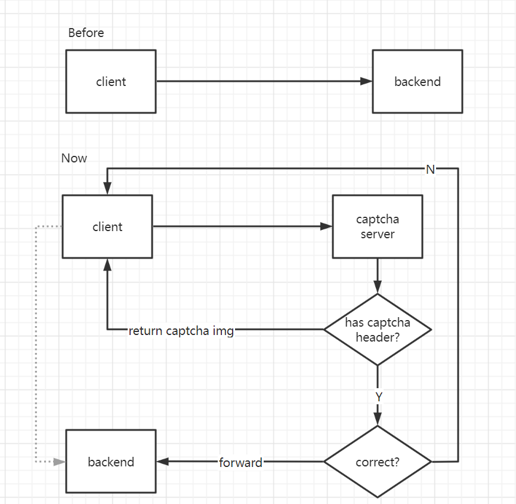

# A captcha server





### cfg.yml config 

```yaml
#server
#listen addr
addr: 127.0.0.1:9001
#forward request to backend
backend: 127.0.0.1:8899


#client
#Validity period of the captcha
expire: 30
#request queue count
max: 5e4
#mini block time (second)
#It will increases as consecutive failures increases
wait: 300
#failed times allow
block: 6

#captcha
font: ./font.ttf
#image width
width: 150
height: 50
#text length
length: 5
noise: 1
curve: 4
background: 0xffffff
dpi: 60
#text colors
colors:
  - 0x06d6a0
  - 0x118ab2
  - 0x073b4c
  - 0xef476f
  - 0x708d81
  - 0x723d46
  - 0x3d405b
  - 0xe07a5f
```
             

### usage   
```bash
captcha-serv -cfg /xxx/cfg.yml
```

### Caddyfile example
todo
```
example.com {
   @is_captcha {
   
   }
   
   @captcha_forward {
   
   
   }
   
   reverse_proxy @is_captcha /captcha 127.0.0.1:9001 {
   
   }
   
   reverse_proxy @captcha_forward /api 127.0.0.1:9001 {
   
   }
   
   reverse_proxy  @other_api  backend 
}
```